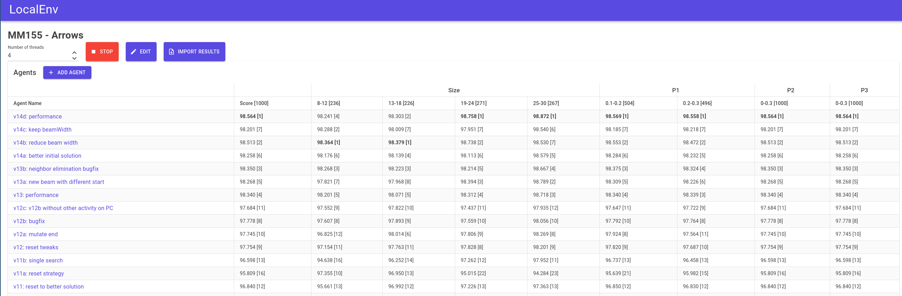
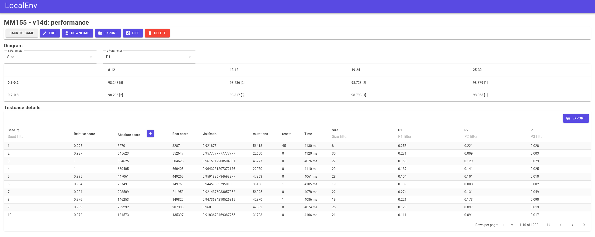
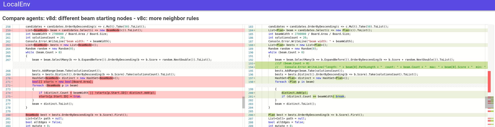
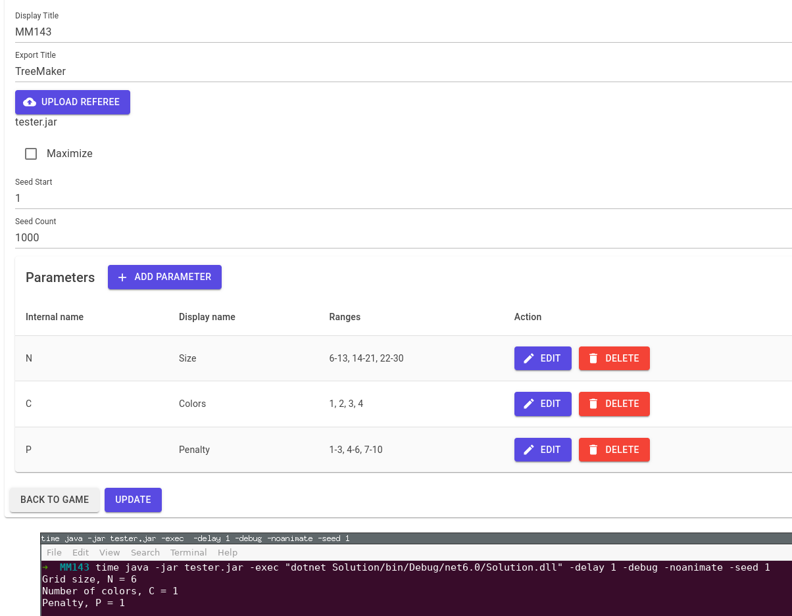

# LocalEnv
LocalEnv allows you to compare different versions of your TopCoder Marathon Match bots.

### Pre-requisits
You'll need the .net 6 runtime to execute it and .net 6 SDK to compile. Entity Framework is needed to create a new database.

### Compile
Compile it with `dotnet publish -c Release`. Create a new database with `dotnet ef database update`.

### Execute
Either compile it yourself or get a pre-built version from https://github.com/eulerscheZahl/LocalEnv/releases
To launch it, use `dotnet LocalEnv.dll`, then visit https://localhost:5000/
You might have to instruct your browser to trust that page despite missing certificate.

### Features
Compare agents

Detailed view of an agent

Compare codes

### Use
#### Create a new game
`Display title` is shown in the local environment and can be something like "MM143".
`Export title` is the name used on TopCoder (e.g. "TreeMaker")
Next you have to upload the tester.jar given by TopCoder, specifiy whether you want to maximize or minimize and define a range of seeds you want to test on.
Parameters have to match the naming of tester.jar

Creating a game will take a while, as each testcase will be executed in order to extract the specific parameter values.

#### Upload a new agent
After creating a game, you will be redicted to the game overview page. Click "Add agent" to upload code.
For C# it's possible to add multiple files to a single zip and let LocalEnv merge them on export. For other languages your .zip may only contain a single file.
Click "Add agent", assign a name, language and upload the code. It will automatically start to play all testcases.

#### Agent details
Each agent has a dedicated page with scores per testcase and possibly additional info.
In order to export more than just a score, make your bot print the following to stderr: `TESTCASE_INFO {<json dictionary of string-key and double-value>}`, e.g. `TESTCASE_INFO {"Moves": 123, "Layout Penalty": 45}`
